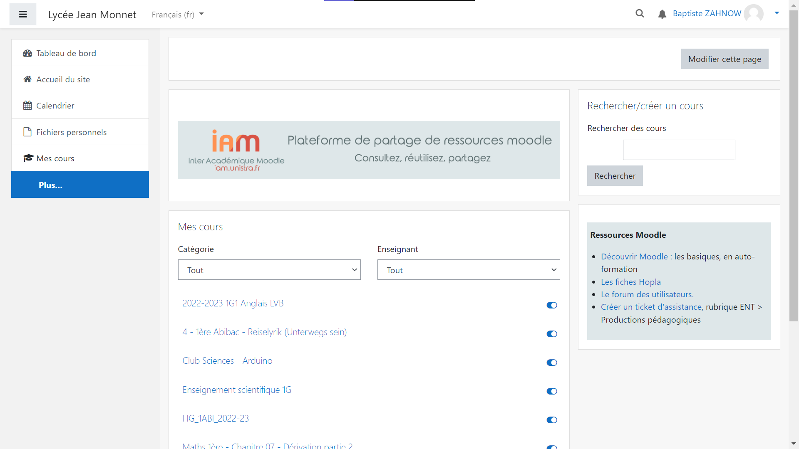
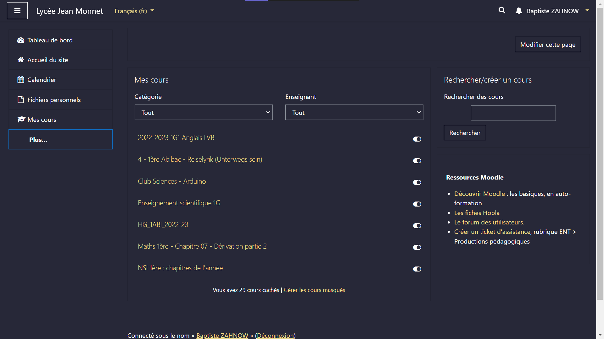
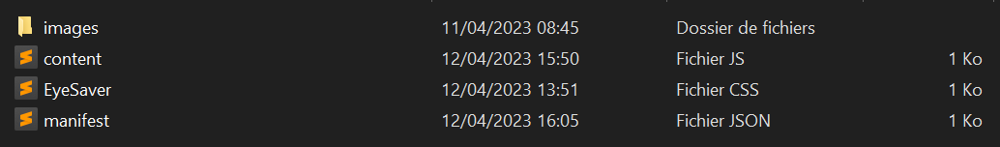
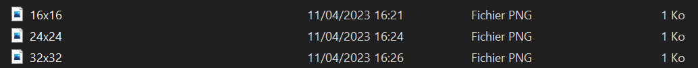
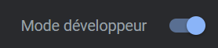
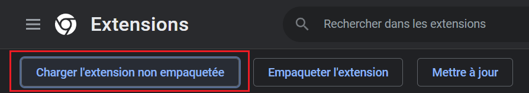
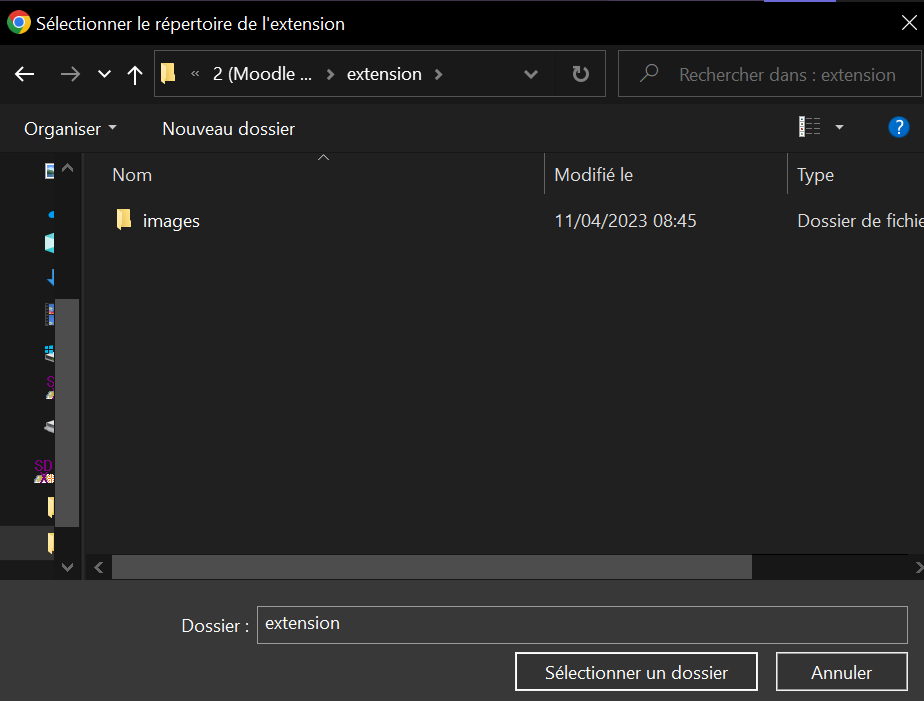

<h1 align="center">Moodle DarkMode</h1>

<p align="center">Tu as tes yeux qui sont en décomposition dès que tu ouvres Moodle ?</p>

<p align="center">Maintenant plus!</p>

<a href="/extension" download>Installer l'extension Google Chrome</a>

<h2>Table des matières:</h2>

- Introduction
- Bien fait de l'utilisation
- Comment téléchargement et execution
  - Arborescence des fichiers de l'extension
  - Ajouts à chrome
- Explications du code
  - manifest.json
  - MoodleDarkMode.css
  - content.js

## Introduction

L'extension **Moodle Darkmode** est un mini-projet pour le site internet [Moodle](https://moodle.com/fr/).

Utilisez cette extension sur Google Chrome pour une utilisation plus Sympatique et ne pas sursauter quand c'est le soir et que vous devez allez sur moodle pour rendre un devoir, cela ne vous arriveras plus grâce à Moodle Darkmode.

## Bien fait de l'utilisation de l'extension

L'utilisation de l'extension fait augmenter de beaucoup la durée de vie de votre batterie, elle contribue à économiser la batterie de l'appareil due à la luminosité qui est réduite grâce à la palette de couleur utilisé.



Le mode sombre utilise des couleurs plus sombres ce qui peut réduire la fatigue oculaire, surtout l'orsqu'on utilise Moodle à longueur de journée, notamment le soir. Le mode sombre est souvent considéré comme esthétiquement moderne et élégant, ce qui peut donner une impression de sophistication et de qualité à Moodle.



## Comment téléchargement et executer l'extension

L'extension est simple à installer, vous avez juste besoin d'intstaller le dossier [Extension](./extension/) pour ensuite suivre les étapes suivante:

### Arborescence des fichiers de l'extension

Pour pouvoir mettre l'extension correctement, il faut bien respecter l'arboréscence des fichier, qui est:
```
extension
  | images
      | 16x16.png
      | 24x24.png
      | 32x32.png
  | content.js
  | MoodleDarkMode.css
  | manifest.json
```
version imager:



dans le dossier images:



### Ajouts à chrome

Pour ajouter l'extension à chrome, aller sur [ce lien pour vous retrouver où il y a vos extensions](chrome://extensions/), après être allez dessus, n'oublier surtout pas d'**activer le Mode développeur**



Ensuite apppuyer sur **Charger l'extension non empaquetée**:



vous avez plus qu'a allez dans le dossier de l'extension et cliquer jusqu'à plus que voir le dossier **images** (les fichiers ne sont pas montrer, seulement les dossier) Et pour finir appuyer sur **"Sélectioner un dossier"**.




## Explications du code

Pour vous assurer que l'extension est simplement ici pour changer des couleurs et enlever quelque element du site internet, pourquoi pas vous expliquer comment les fichier fonctionnent et comment vous pouvez les modifier pour par exemple mettre les couleurs que vous voulez ?

### [manifest.json](./extension/manifest.json)

> `"name": "Moodle DarkMode"` s'agit du nom de votre extension, qui sera affiché dans la liste des extensions de navigateur.

> La clé `"description"` est là pour faire une brève description de ce que fait votre extension. Elle peut être affichée dans la liste des extensions ou dans la page de détails de l'extension dans le navigateur.

> `"author": "Baptiste Zahnow"` s'agit de moi :P

> `"version": "1.2.5"` est le numéro de version actuel de l'extension. Vous pouvez le mettre à jour chaque fois que vous publiez une nouvelle version de l'extension.

> `"manifest_version": 3` est très important. la version 2 n'est bientot plus utilisable pour google chrome, donc en version 3, l'extension n'auras aucun soucis de compatibilité pour la suite de ses jours

> `"action": {}` est obligé d'y être sinon l'extension est inutilisable et crée un erreur.

> `"content_scripts"` s'agit d'un tableau qui spécifie les scripts JavaScript et les fichiers CSS à injecter dans les pages web correspondant à certains modèles d'URL, définis dans la propriété **"matches"**. Dans notre cas, le script JavaScript "[content.js](./extension/content.js)" et le fichier CSS "[MoodleDarkMode.css](./extension/MoodleDarkMode.css)" seront injectés dans les pages web correspondant à l'URL "https://.moodle.monbureaunumerique.fr/", c'est-à-dire les pages web de Moodle hébergées sur le domaine "moodle.monbureaunumerique.fr".

### MoodleDarkMode.css

Le fichier MoodleDarkMode est utilisé pour stylisé la page moodle comme on le souhaite mais juste quelque choses sont à respecter, vous ne pouvez pas enlever les choses qui y sont déjà, vous pouvez seulement modifier les choses qui sont déjà écrite dedans sans oublier de mettre le `!important` pour la spécificité (plus sur la spécifité [ici](https://developer.mozilla.org/en-US/docs/Web/CSS/Specificity)). vous pouvez ajouter du css comme vous le voulez mais pour le bon fonctionement de l'extension, il est préférable de ne pas changer la toute première ligne du fichier css, qui est:

```css
*, *:has(:not(.vjs-poster, .vjs-text-track-display, .vjs-text-track-display > div, .vjs-iframe-blocker, .video-js)), nav.bg-white, button.bg-gray, footer.bg-dark
```

### content.js

Le fichier JavaScript est simplement là pour enlever des élément de la page, comme par exemple la pub pour le portail de l'unistra, vous pouvez le modifier à votre guise.